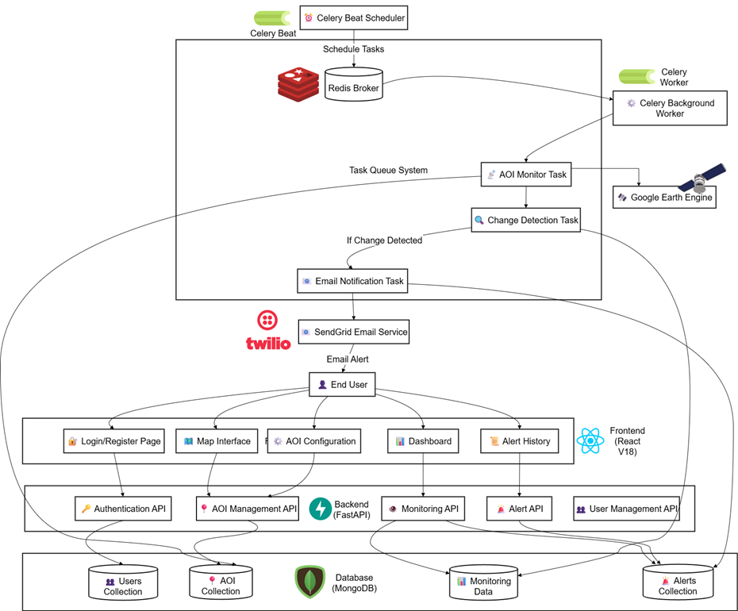
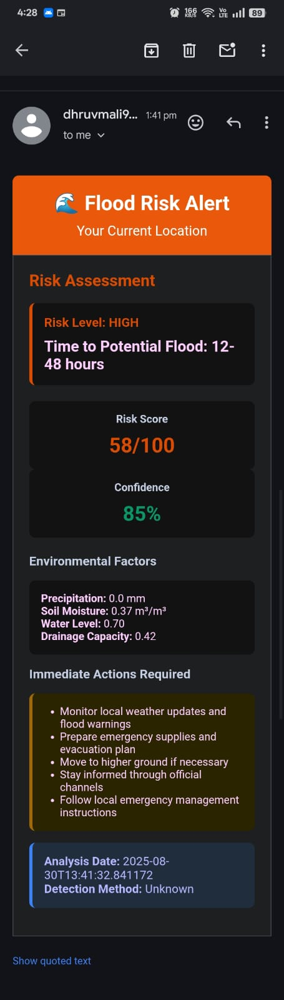
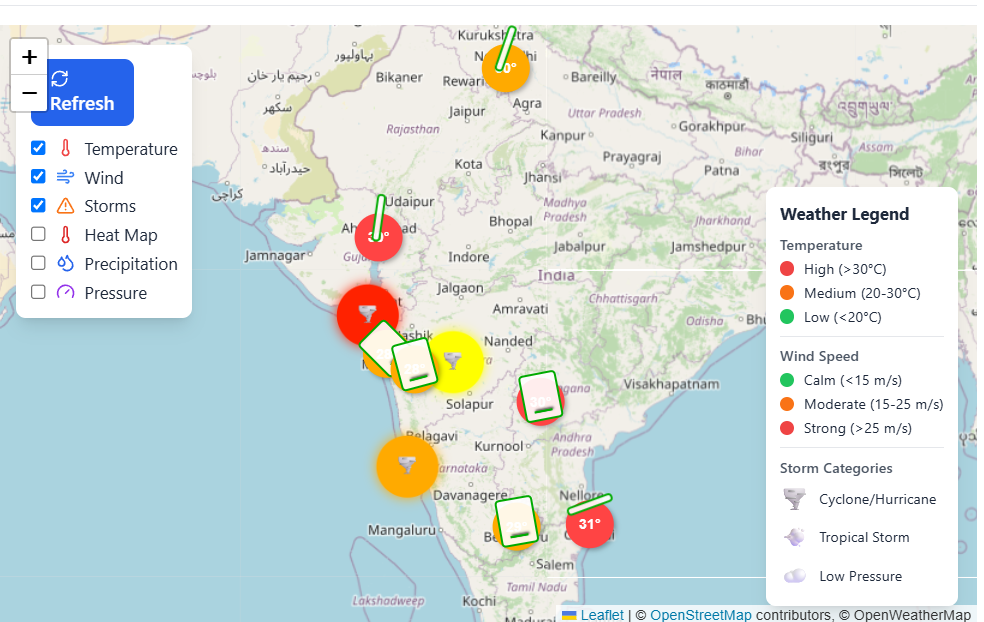
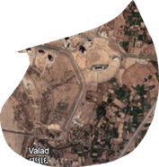
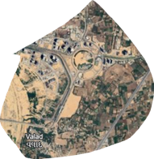

# 🌊 Coastal Threat Detection System : CodeYatra

A comprehensive AI-powered coastal monitoring and threat detection system that combines satellite imagery analysis, real-time weather monitoring, and flood risk assessment to protect coastal communities.



## 🚀 Features

### 🔍 **Area of Interest (AOI) Monitoring**
- Interactive map drawing for monitoring areas
- AI-powered satellite imagery change detection
- Real-time alerts for coastal changes
- Historical tracking and analysis

### 🌤️ **Live Weather & Storm Monitoring**
- Real-time weather data from OpenWeatherMap
- Professional wind visualization with barbs
- Storm tracking and path prediction
- Multiple weather layer overlays

### 💧 **Flood Detection & Risk Assessment**
- GPS-based flood risk analysis
- Google Earth Engine integration
- Automated 3-hour monitoring
- Email alerts for high-risk areas

## 🏗️ System Architecture

### **Backend (FastAPI + Python)**
- FastAPI for high-performance API
- MongoDB for data storage
- Celery for background tasks
- Google Earth Engine integration
- Redis for task queuing

### **Frontend (React + TypeScript)**
- React 18 with modern hooks
- TypeScript for type safety
- Leaflet for interactive mapping
- Tailwind CSS for styling
- Real-time data updates

## 📸 System Screenshots
### **Flood Alert Email**

*Coastal area before change detection analysis*

### **HeatMap**

*Cyclone map*

### **Before Analysis - Coastal Area**

*Flood Prediction*

### **After Analysis - Detected Changes**

*Coastal area after change detection with highlighted modifications*

## 🔮 Future Implementations
- Custom DL pipline for anomaly and algal blooms.
- Current cutom pipeline for Shoreline detection and monitoring which can be viewed at ./Models/fetch_noaa_data.py and test_flood_detection. 
 Data API From https://www.noaa.gov/ocean-coasts


## 🚀 Quick Start

### **Prerequisites**
- Python 3.8+, Node.js 16+, MongoDB, Redis
- Google Earth Engine account
- OpenWeatherMap API key

### **Backend Setup**
```bash
cd backend
python -m venv venv
source venv/bin/activate
pip install -r requirements.txt
python main.py
```

### **Frontend Setup**
```bash
cd frontend
npm install
echo "VITE_OPENWEATHER_API_KEY=your_api_key" > .env
npm run dev
```

## 🔧 Configuration

### **Required API Keys**
- OpenWeatherMap: Weather data and maps
- SendGrid: Email notifications
- Google Earth Engine: Satellite imagery
- MongoDB: Database connection

## 📊 API Endpoints

- **Authentication**: `/auth/register`, `/auth/login`
- **AOI Management**: `/aois/` (CRUD operations)
- **Shoreline Analysis**: `/shoreline/analyze`
- **Flood Detection**: `/flood/detect`

## 🎯 Use Cases

- **Government**: Coastal management and disaster preparedness
- **Research**: Climate studies and environmental monitoring
- **Private Sector**: Risk assessment and planning

## 🔒 Security Features

- JWT authentication with bcrypt hashing
- API rate limiting and input validation
- CORS protection and secure endpoints

## 🚧 Development Status

- ✅ Core AOI monitoring system
- ✅ Weather integration and mapping
- ✅ Flood detection and alerts
- 🚧 Advanced AI model training
- 📋 Production deployment

## 🤝 Contributing

1. Fork the repository
2. Create a feature branch
3. Make changes and add tests
4. Submit a pull request


---

**Built with ❤️ for coastal communities worldwide**

*Protecting our coasts, one pixel at a time* 🌊🛡️
